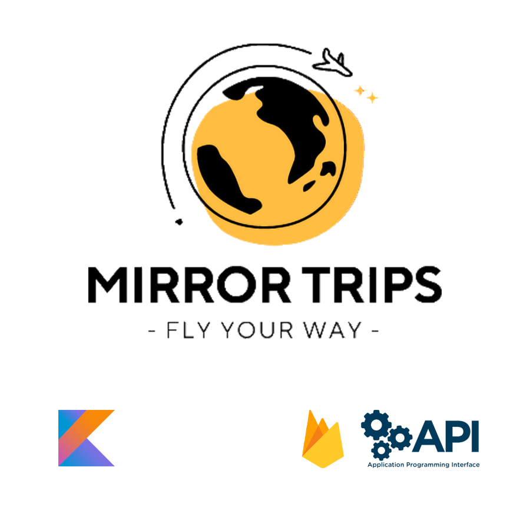

# MirrorTrips®

Travel Agency app responsible for giving the costumer an oportunity to choose a vacation destiny from the costumer expectations.

  

---

## Features

- **Login and Registration:**  
  The app allows the user to make a registration, and the data is stored for future login.
  
- **Multiple types, themes and budgets of vacations:**  
  The app provides multiple choices of vacation to the user, having in consideration 4 types of destiny, 4 themes of vacation, and 3 travel budgets. In the end of the choices, the user still can choose between to destinies; having important information of each one of them.

- **Use of Firebase for data storage:**  
  Our application stores the database model of all the vacations destinies in Firebase.

- **Use of API's and Weblinks:**  
  The project features the use of 2 APIs and 3 Weblinks connected to each final destinations:
  - **Booking.com** API to search acommodation to destination;
  - **smtp** API for e-mail contact;
  - **Youtube.com** link to observe the destination;
  - **Local Tourism website** link to obtain important destination;
  - **Google Flights** Link to search flights to destination.

---

## Controls

- **Touch:**  
  - MirrorTrips® is a mobile app controlled by touch.  
  
---

## Images

  

---

## Note

Clone the repository. 
Run it on Android Studio.

---

## Dev Team

- [Ademar Valente](https://github.com/ademar1k82)
- [José Lourenço](https://github.com/Zeet76)
- [Pedro Frederico Silva](https://github.com/FredSilva92)

---

This project was developed for academic purposes as part of the **2nd Year Game Development for Mobile Platforms** class at IPCA, 2024.

## License
All rights reserved.
